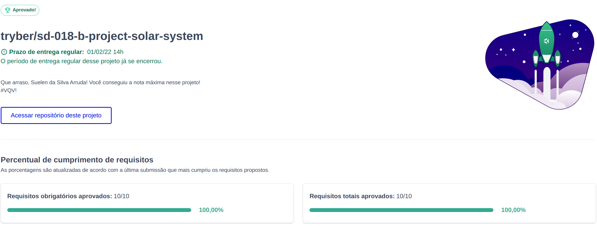

# 🪐 Solar System Project :alien:

 Nosso primeiro projeto em React! Mesmo sendo relativamente simples, tivemos mais ou menos uma semana para aprender e aplicar os conhecimentos

---

## Habilidades Desenvolvidas

  * Utilizar JSX no React

  * Utilizar corretamente o método `render()` para renderizar seus componentes

  * Utilizar `import` para trazer componentes em diferentes arquivos

  * Criar componentes de classe em React

  * Criar múltiplos componentes a partir de um array

  * Fazer uso de `props` corretamente

  * Fazer uso de `PropTypes` para validar as `props de um componente`

---

### Desenvolvimento

Foi desenvolvida uma aplicação em React com criação de componentes de classe e passagem de props. Essa aplicação simula uma visualização do **Sistema Solar**, bem como informações sobre diversas missões espacias que ocorreram ao longo da história.

### Observações técnicas

  * Instale as dependências:
    * `npm install`
  * Inicialize o projeto:
    * `npm start` (uma nova página deve abrir no seu navegador )

 
---
---

### Stack utilizada

  
   
  
  
 

---

### Gif do Projeto finalizado

--- 

### Status do Projeto 

---

### 🔗 Links

